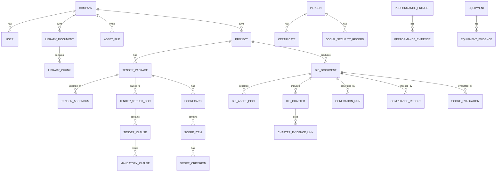

# Bidexpert 系统升级交付文档

**面向：电力工程评标专家｜电力施工企业投标工程师｜AI 技术负责人** **用途：可直接喂给 AI 编程助手（Codex/Qwen/DeepSeek 等）的系统升级修改规格（Spec + Tasks + 数据结构 + 算法设计）** **版本：v2.0（基于 v1.2 需求，深度强化隐性废标防御、FastAPI 设计与评分引擎解析）** ---

## 目录
1. [背景与原则](Bidexpert%20V2.0%20系统升级交付文档.md#背景与原则)  
2. [《Bidexpert 核心需求 v2.0 电力工程专业增强版》](Bidexpert%20V2.0%20系统升级交付文档.md#bidexpert-核心需求-v20-电力工程专业增强版)  
3. [《防废标红线引擎技术实现细则与 FastAPI 设计》](Bidexpert%20V2.0%20系统升级交付文档.md#防废标红线引擎技术实现细则与-fastapi-设计)  
4. [《评分引擎算法设计与解析流程》](Bidexpert%20V2.0%20系统升级交付文档.md#评分引擎算法设计与解析流程)  
5. [《数据库完整 ER 结构》](Bidexpert%20V2.0%20系统升级交付文档.md#数据库完整-er-结构)  
6. [《可直接喂给 AI 编程助手的系统升级任务包》](Bidexpert%20V2.0%20系统升级交付文档.md#可直接喂给-ai-编程助手的系统升级任务包)  
7. [验收标准（Definition of Done）](Bidexpert%20V2.0%20系统升级交付文档.md#验收标准definition-of-done)  
8. [附录：关键 Prompt / 输出格式规范](Bidexpert%20V2.0%20系统升级交付文档.md#附录关键-prompt--输出格式规范)  

---

## 1. 背景与原则

### 1.1 背景
Bidexpert 是电力施工企业使用的 AI 辅助投标文件编制系统，核心流程包含：专家库生成、招标拆解、目录生成、逐章生成、合规与模拟打分、排版归档。
v1.2 已明确：技术文件与公司资产分别入库；招标文件由用户在本地 minerU 客户端 OCR/结构化后上传 ZIP；系统端调用商业或本地模型完成处理。本期 v2.0 将补齐隐性废标漏洞与复杂资产组合能力。

### 1.2 总体原则（必须落地为代码机制）
1. **红线阻断**：存在“致命废标风险”时，系统必须阻断进入“正文生成”。
2. **事实锚定（反幻觉底线）**：关键事实必须可溯源到库内来源 ID。**强烈要求优先通过关系型数据库（SQL/图）匹配，避免纯向量检索（RAG）引发的实体错乱幻觉**。
3. **评标驱动**：生成不是“写得像”，而是“逐项对照评分细则、逐条响应招标要求”。
4. **章节级路由**：不同模块/章节选择不同模型（推理/生成/校验/排版），并提供兜底逻辑。
5. **结构化优先**：资产类（人员/证书/社保/业绩/设备）必须前置结构化。
6. **可交付**：支持断点续跑、版本管理、审改留痕、导出可打印 PDF。

---

## 2. Bidexpert 核心需求 v2.0 电力工程专业增强版

### 2.1 系统定位升级
Bidexpert 不再是“AI 写标书工具”，而是：**面向电力施工企业的【评标逻辑驱动型智能投标系统】**。
核心目标实现：零废标风险、评分最大化、内容真实可溯源、规模化生产。

### 2.2 总体流程（v2.0 强化版）
```text
导入/维护专家库与公司资产
        ↓
招标文件拆解（结构化输入）  <--- [新增] 答疑/澄清文件增量解析（覆盖原规则并触发警报）
        ↓
G2 防废标红线引擎（阻断式，输出“粮草齐套性”看板）
        ↓（通过）
G3 评分规则结构化引擎（多步提取机制）
        ↓
G4 目录智能生成（评分项 + 招标要求驱动）
        ↓
G5 逐章生成（事实锚定 + [FROZEN]防篡改块 + 实体表格直接装配）
        ↓
G6 合规审查与模拟打分（含负偏离惩罚与逐项扣分说明）
        ↓
G7 排版导出（docx→pdf）与归档
        ↓
G8 回灌与知识进化（仅最终版/中标版/高分版）
```

---

## 3. 防废标红线引擎技术实现细则与 FastAPI 设计

### 3.1 引擎构成与深度校验逻辑
在投标文件生成前，完成“符合性审查一票否决项”与“逻辑一致性”检测。输出不仅是报错，必须包含**“粮草齐套性看板”（缺件清单）**。

* **G2.1 强制条款提取**：提取一票否决、强制响应及格式条款。**注意：** 后续上传的答疑澄清文件（Addendum）必须能精准覆盖这里的初始提取结果。
* **G2.2 资质有效性核验**：校验资质等级匹配、有效期覆盖开标期及主体一致性。
* **G2.3 关键人员与社保核验**：结构化匹配“岗位→人员→证书→社保”。防范同一人员在多个并行项目中同时被分配为“专职”。
* **G2.4 授权与签章完整性**：提取附件模板关键字段，确保承诺函**一字不改**。
* **G2.5 阻断控制 Gate**：P0 触发直接阻断，P1 强制整改。提供带审计日志的“人工确认 Override”。
* **G2.6 逻辑一致性与参数负偏离核验（v2.0 新增致命伤防御）**：
  * **参数比对**：从公司设备库匹配的参数必须 `>=` 招标要求值（正偏离通过，负偏离 P0 阻断）。
  * **算术逻辑**：承诺总工期必须 `==` 竣工日期 - 开工日期；且不得短于招标最短工期。

### 3.2 Python/FastAPI 核心逻辑与结构定义 (Schemas)
以下骨架代码供后端实现参考，确保系统拥有标准的结构化数据流动。

```python
from pydantic import BaseModel, Field
from typing import List, Literal

# 1. 核心 Schema 定义
class ClauseReference(BaseModel):
    doc_id: str
    loc: str
    text: str

class EvidenceReference(BaseModel):
    source_id: str
    quote: str

class ComplianceFinding(BaseModel):
    severity: Literal["P0", "P1", "P2", "P3"]
    category: Literal["资质", "人员", "社保", "业绩", "授权", "签章", "强制条款", "格式", "参数一致性", "其他"]
    rule_id: str
    tender_clause_ref: ClauseReference
    evidence: List[EvidenceReference] = []
    problem: str
    required_action: str
    suggested_fix: str
    blocking: bool

class RedlineReport(BaseModel):
    status: Literal["PASS", "BLOCKED", "NEED_FIX"]
    summary: str
    readiness_missing_items: List[str] = Field(description="粮草齐套性缺件清单，如'缺110kV类似业绩1份'")
    findings: List[ComplianceFinding]

# 2. FastAPI 路由与服务骨架 (app/api/routers/g2_redline.py)
from fastapi import APIRouter, HTTPException, Depends

router = APIRouter(prefix="/api/v2/redline", tags=["G2 Redline Engine"])

@router.post("/check", response_model=RedlineReport)
async def run_g2_redline_check(project_id: str, tender_package_id: str):
    """
    执行 G2 防废标红线引擎全量检查
    """
    # 步骤 1: 加载经过答疑文件 (Addendum) 修正后的最新强制条款
    clauses = await load_effective_mandatory_clauses(tender_package_id)
    
    # 步骤 2: 加载本次投标划定的可用资产池 (支持联合体及授权隔离)
    asset_pool = await load_bid_asset_pool(project_id)
    
    findings = []
    missing_items = []
    
    # 步骤 3: 运行独立的规则校验器 (强制 Python 硬逻辑计算，禁止使用大模型判断算术)
    findings.extend(await check_qualifications(clauses, asset_pool))
    findings.extend(await check_key_staff_and_ss(clauses, asset_pool))
    findings.extend(await check_technical_params_deviation(clauses, asset_pool)) # 负偏离与算术检查
    
    # 步骤 4: 汇总状态
    has_p0 = any(f.severity == "P0" for f in findings)
    has_p1 = any(f.severity == "P1" for f in findings)
    status = "BLOCKED" if has_p0 else ("NEED_FIX" if has_p1 else "PASS")
    
    # 步骤 5: 提取缺件看板数据 (Readiness Dashboard)
    for f in findings:
        if f.category in ["人员", "资质", "业绩", "社保"] and f.severity in ["P0", "P1"]:
            missing_items.append(f.required_action)
            
    return RedlineReport(
        status=status,
        summary=f"完成红线审查，发现 {len(findings)} 项风险。",
        readiness_missing_items=list(set(missing_items)),
        findings=findings
    )
```

---

## 4. 评分引擎算法设计与解析流程

### 4.1 G3 评分规则结构化解析流程（反幻觉策略）
不要试图让大模型一次性“吃下”并吐出整个庞大的评分表。必须采取**多步分治解析策略**：
1. **表格结构提取（Table Detection）**：利用 minerU 的输出，精准定位招标文件中的 Markdown/HTML 表格块。
2. **LLM 语义解析（Semantic Structuring）**：传入提取出的纯表格文本，使用开启了 `json_object` 模式的强推理模型（温度 `Temperature=0`），逐行提取评分细则。
3. **专家人工确认（Human-in-the-loop）**：将生成的 JSON 渲染为前端界面，由工程师核对得分/扣分条件及对应章节，确认后锁定入库。

### 4.2 G6 模拟打分算法公式补充
对每个评分点 `p`，计算其覆盖率 (`cov`)、证据强度 (`evi`)、针对性 (`spec`) 和风险度 (`risk`)。
如果 `risk` 中包含参数负偏离或核心算术逻辑冲突，该项得分强制归零。

**计算公式：**
`score(p) = weight(p) * clamp( 0.55*cov + 0.25*evi + 0.20*spec - 0.50*risk, 0, 1 )`
评分项总分 `score(item) = Σ score(p)`（受 `max_score` 封顶限制）。

模拟打分模块必须输出：预测分、`deductions`（逐项扣分原因）和 `evidence_map`（证据位置图）。

---

## 5. 数据库完整 ER 结构

使用 PostgreSQL（业务数据支持 SQL 与图查询） + pgvector/Milvus（非结构化向量检索）。

### 5.1 Mermaid ER 图


### 5.2 核心新增实体定义
* **TENDER_ADDENDUM (答疑/澄清文件)**
  * `id`, `tender_package_id`
  * `parsed_overrides_json`: 记录覆盖了原招标文件的哪些具体条款编号和硬性要求。
* **BID_ASSET_POOL (本次投标可用资产池)**
  * `id`, `bid_document_id`
  * `asset_type` (company / person / equipment / performance)
  * `asset_id` (关联具体资产库)
  * `ownership_role` (牵头人 / 联合体成员 / 分包商 - 解决联合体资产交叉混乱问题)。

---

## 6. 可直接喂给 AI 编程助手的系统升级任务包

### 6.1 工作流引擎升级（G0~G8）
- [ ] **Workflow Orchestrator**：新增 `GenerationRun` 表。实现 `run_step()` 幂等控制，支持断点续跑。
- [ ] **Addendum Parser (答疑穿透)**：接入澄清文件增量解析逻辑。解析后必须覆盖 `MANDATORY_CLAUSE` 和参数要求表，并触发原有已生成章节的失效告警机制。

### 6.2 资产结构化与匹配算法（Assets）
- [ ] **关系型匹配算法替换**：针对人员与业绩的调取，废弃纯向量检索，改用基于标段约束的 SQL 精确过滤机制。
- [ ] **智能人员匹配器**：根据资质、社保、业绩复合查询，输出“满足项最大 + 证据最强”的项目团队组合方案。

### 6.3 章节生成引擎强化（G5 确定性升级）
- [ ] **Frozen Blocks (防篡改锚点)**：在生成法律声明、廉政承诺模板时注入 `[FROZEN]` 块。排版导出阶段硬性校验这些文本的 MD5，确保未被 LLM “润色”掉哪怕一个字。
- [ ] **Entity Assembly Mode (实体装配模式)**：对于“类似业绩表”、“投入机械表”，绕过 LLM 生成，使用 Python Jinja2 直接将 SQL 查询出的 `BID_ASSET_POOL` 渲染为 Markdown 表格，确保数据 100% 精确。
- [ ] **严格事实锚定**：所有生成的业务陈述必须关联 `CHAPTER_EVIDENCE_LINK`。

### 6.4 模型路由策略 (Model Router)
- [ ] 按 `role_scope` 配置不同模型及兜底模型。
- [ ] 在提取结构化 JSON 任务时，强制底层 API 调用传入 `response_format={ "type": "json_object" }` 参数。

---

## 7. 验收标准（Definition of Done）

### 7.1 合规与红线（G2）
- [ ] **逻辑阻断**：逻辑一致性与负偏离核验（G2.6）顺利执行，承诺数值低于招标参数时成功抛出 P0 阻断。
- [ ] **齐套性看板**：红线引擎不仅输出报错，必须成功组装并返回前端可渲染的“粮草齐套性缺件清单”。
- [ ] **资产隔离**：联合体与资产隔离测试通过，A 项目绝对不会跨界拉取 B 项目未授权的实体数据。

### 7.2 评分驱动与生成（G3/G5/G6）
- [ ] **分治提取**：评分表提取成功率 > 95%，且完全符合预定 JSON Schema。
- [ ] **实体渲染**：实体资产表使用代码模板渲染成功，未被 LLM 篡改。
- [ ] **防篡改保护**：`[FROZEN]` 核心法律文本在全流程中保持一字不改。
- [ ] **扣分解释**：模拟打分引擎准确输出 `deductions` (扣分原因) 及其量化修正建议。

---

## 8. 附录：关键 Prompt / 输出格式规范

### 8.1 评分规则提取 Prompt (G3)
**System Prompt:**
```text
你是资深的电力工程评标专家。你的任务是从招标文件提供的“评标办法/评分细则”文本中，精准提取评分项，并严格按照 JSON 格式输出。
不得漏项，不得编造。遇到定性描述（如“优得5分，良得3分”），需将其拆分为具体的 criteria。输出必须是有效的 JSON 格式。
```

**User Prompt:**
```text
请解析以下评分表文本：
{tender_score_text}

输出 JSON Schema 要求如下：
{
  "total_score": "总分（数字）",
  "method": "综合评估法 或 经评审的最低投标价法",
  "items": [
    {
      "item_id": "S-序号（如 S-001）",
      "name": "评分项名称（如 施工组织设计、项目经理业绩）",
      "max_score": "该项满分（数字）",
      "criteria": [
        {
          "point": "具体的得分或扣分条件描述",
          "weight": "该条细则对应的分值（数字）",
          "type": "qualitative（定性） 或 quantitative（定量）",
          "evidence_required": ["需要提供的证据类型，如 '类似工程业绩合同', '建造师注册证书'"]
        }
      ]
    }
  ]
}
```

### 8.2 强制条款抽取 Prompt (G2.1)
**输出约束：**
```json
{
  "mandatory_clauses": [
    {
      "clause_no": "string",
      "text": "string",
      "response_required": true,
      "evidence_required": ["string"],
      "severity_suggested": "P0|P1|P2|P3",
      "notes": "string"
    }
  ]
}
```
*注：识别“否则废标/无效投标”等字眼优先标为 P0；不确定时降级为 P1/P2 并在 notes 注明。*