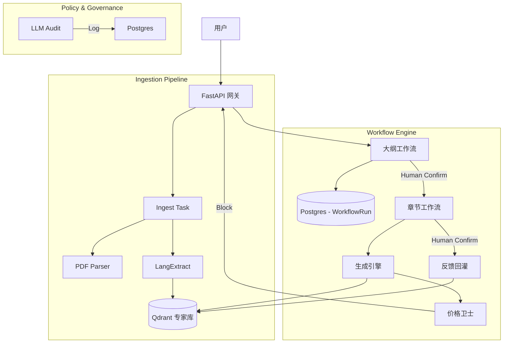

# 需求与现状差异分析文档

## 1. 目标需求概述

本系统旨在构建一个“通用工程投标系统”，核心能力包括：
- **历史标书智能拆解**：本地目录批量导入，自动构建专家知识库。
- **新标书全流程辅助**：拆解、大纲生成与确认、逐章生成与确认、最终排版。
- **严格合规审查**：逐条对照招标文件要求进行审查与修改建议。
- **模拟评分**：基于招标文件评分标准进行模拟打分。
- **无报价约束**：系统严格不处理任何报价相关内容。
- **预算接口化**：保留预算接口但不作为模型选择依据，不阻断流程。
- **多模型预留**：支持多商业模型接入（当前默认 Qwen）。

---

## 2. 现状与完成度分析

### 2.1 已实现核心模块 (Completed)

| 模块 | 功能描述 | 实现状态 | 对应代码 |
|------|----------|----------|----------|
| **历史标书拆解** | 基于 `langextract` 的结构化拆解与入库 | ✅ 已完成 | `app/services/historical_extractor.py` |
| **本地批量导入** | 支持本地目录递归扫描与批量入库任务分发 | ✅ 已完成 (P0) | `/v1/tasks/ingest-directory` |
| **大纲工作流** | 标书拆解 -> 生成大纲 -> **用户确认** -> 锁定大纲 | ✅ 已完成 (P0) | `/v1/workflow/outline/*` |
| **章节工作流** | 基于确认大纲 -> 逐章生成 -> **用户确认** -> 反馈回库 | ✅ 已完成 (P0/P1) | `/v1/workflow/section/*` |
| **持久化存储** | 基于 PostgreSQL 的工作流状态管理 (`WorkflowRun`) | ✅ 已完成 (P0) | `app/models/tables.py` |
| **价格熔断** | 全局拦截报价相关内容 (生成/上传/解析) | ✅ 已完成 (P0) | `app/services/pricing_guard.py` |
| **预算策略** | 仅记录 token 消耗，不阻断生成流程 | ✅ 已完成 (P0) | `app/services/generation_pipeline.py` |
| **知识库回灌** | 用户确认后的优质章节自动回流专家库 | ✅ 已完成 (P1) | `/v1/evidence/feedback-upsert` |

### 2.2 待实现/完善模块 (Pending/In-Progress)

| 模块 | 差距描述 | 优先级 | 计划路径 |
|------|----------|--------|----------|
| **严格审查引擎** | 当前仅有三闸校验 (覆盖度/确定性)，缺“逐条合规性审查”报告 | High | P1 阶段引入 `ReviewEngine` |
| **模拟评分** | 缺评分模型与打分报告生成 | High | P1 阶段引入 `ScoringEngine` |
| **文档排版** | 当前为基础 Word 模板，缺复杂格式/附件排版能力 | Medium | P2 阶段增强 `word_renderer` |
| **多模型路由** | 接口预留但后端实现仍固定，需配置化模型选择 | Medium | P2 阶段实现 `ModelProviderRegistry` |

---

## 3. 架构设计图 (Current)

## 4. 下一步计划

1. **完善审查与评分**：开发 `ComplianceReviewer` 与 `SimulatedScorer` 服务。
2. **增强 UI 交互**：配合后端 API 实现完整的大纲/章节确认前端页面。
3. **模型配置化**：实现配置文件驱动的多模型后端切换。
